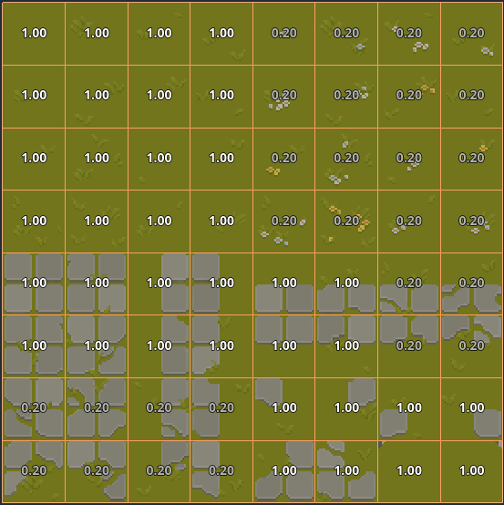
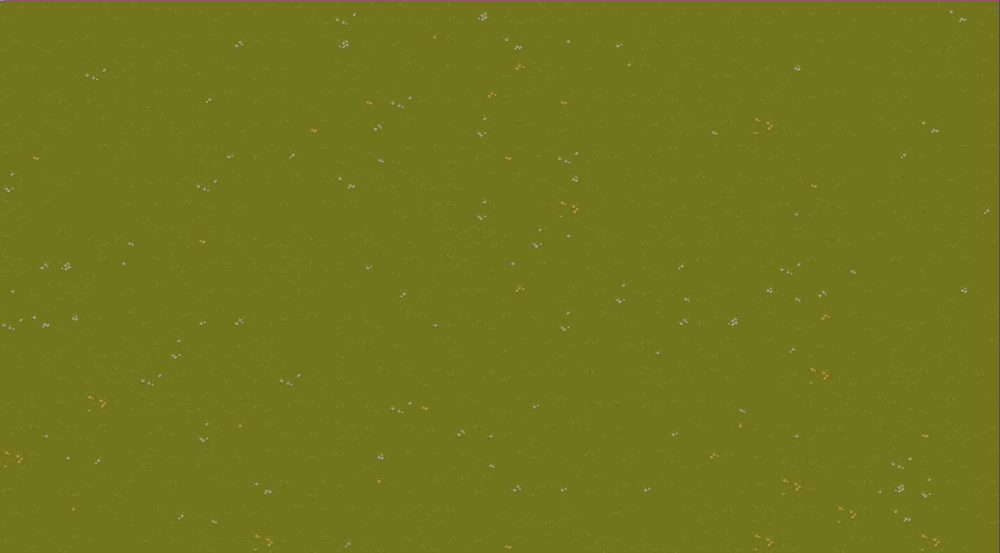
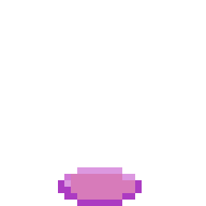

I previously [wrote about]() wanting to start doing some indie game dev on the side for fun. I tried very hard to do some basic 2D things in [Unreal Engine](https://www.unrealengine.com/en-US/) using [Paper2D](https://docs.unrealengine.com/4.26/en-US/AnimatingObjects/Paper2D/) but it felt like a struggle. The system wasn't very easy to use, and I could not figure out a way to do auto tiling or place random tiles down. Auto tiling is a system that would let you draw tiles and have the system automatically pick which pieces to use based on ones already drawn. Imagine you're wanting to place land down over water. As you place tiles, each tile that shares an edge with water would need to have some sort of edge placed to create a smooth transition so that you don't have just solid green blocks where your land is. I could not find a good way to do this in Unreal. I could only place the blocks manually, which takes forever and is a lot of work.

The second system for placing random tiles allows for variations. Imagine you have a green tile for grass, but you might also have a few green tiles that have flowers on them. Ideally, you want a mix of plain green tiles and the tiles with flowers done in a random pattern. In Unreal I could only figure out how to place tiles manually, so you'd have to do every random tile by hand. I looked at tilesets with 10+ variation tiles and placing them all by hand is terrible. Ideally, you'd want a system for taking a group of similar tiles and having it randomly pick one each time you place one. Even better if you can weigh how often each tile shows up, so the flowers are more rare and mostly you see grass. Maybe there's a way in Unreal, but I couldn't find one and I didn't want to build the system myself.

I started looking into [Godot](https://godotengine.org/) since it seemed like it would be better for simple 2D games that I wanted to start with. Fairly early I found that their Tilemap system has a system for [terrain](https://docs.godotengine.org/en/stable/tutorials/2d/using_tilesets.html#creating-terrain-sets-autotiling). This was a huge upgrade, but not intuitive to learn on its own from the Godot docs. Generally I dislike learning from videos, but I did find a [very good set of tutorials](https://www.youtube.com/playlist?list=PLflAYKtRJ7dwtqA0FsZadrQGal8lWp-MM) by [Jackie Codes](https://www.youtube.com/@JackieCodes/about).

I followed along with her tutorial, and it did work, but as we know following a tutorial doesn't often help you retain knowledge. So I started my own project using a texture pack on [Itch.io](https://itch.io/) called [Sprout Lands](https://cupnooble.itch.io/sprout-lands-asset-pack) and tried hooking it up. It worked and was quite easy!

<iframe width="560" height="315" src="https://www.youtube.com/embed/zMz3Aai_b-c?si=nqOQm_8aCVEb8owd" title="YouTube video player" frameborder="0" allow="accelerometer; autoplay; clipboard-write; encrypted-media; gyroscope; picture-in-picture; web-share" allowfullscreen></iframe>

The other thing I wanted to do was to have tiles placed randomly from a set. Turns out there's a super simple way of doing that in Godot using [scattering](https://docs.godotengine.org/en/stable/tutorials/2d/using_tilemaps.html#painting-randomly-using-scattering). Basically, you can select a group of tiles to paint. Normally that would paint the whole group, which can be good for larger objects that take up multiple tiles. However, if you turn scattering on you then only draw a single tile but it randomly determines which tile to draw for each tile you place. You can even set a scattering weight for every tile to change the distribution. I tried this with a grass and flowers tile to get a nice scattering of flowers (and different grass tiles) on a scene.

So that was all very nice and easy to use.

I was also able to figure out a little bit of the collision system and get a character working fast. I used the character and tileset from Sprout Land and set up collision masks for the borders with the water along with some fences. It was easy to get collisions to work; and even movement and animation was pretty fast. I was able to go both in front of and behind a fence by using Y-sorting. I was even able to set up a RayCast to detect objects in front of the player and send signals to trigger opening a chest! All of this was done in one night.

<iframe width="560" height="315" src="https://www.youtube.com/embed/BMuuR1XKG5Y?si=w0yN0YY6Wb-NZi1X" title="YouTube video player" frameborder="0" allow="accelerometer; autoplay; clipboard-write; encrypted-media; gyroscope; picture-in-picture; web-share" allowfullscreen></iframe>

I'm very impressed with the speed I feel I can do things with this engine. My next task will be to be able to walk both over and under a bridge. It's surprisingly tricky, but I think I have an idea for it. Being able to think of how I will code and do a thing and be confident that it'll work is a breath of fresh air compared to Unreal. I'm liking this engine as a beginning game dev.

Also, a friend of mine suggested that I make a game based on a character I played in an RPG. The character was a glutenmancer who could create and control bread products. I decided to load up [Aseprite](https://www.aseprite.org/) and try making a bread summoning animation. Maybe I'll use it eventually, but it was fun.

I love that I'm enjoying and having fun programming and creating art again. It's a breath of fresh air for me. Looking forward to getting some more stuff done, but this is my progress so far.
