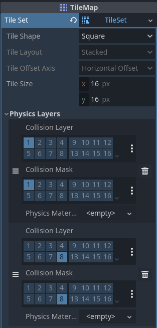
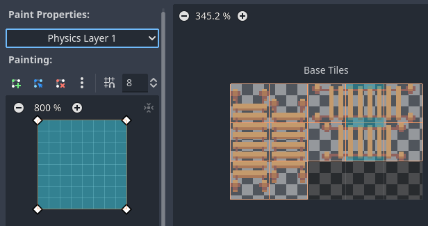
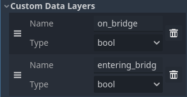
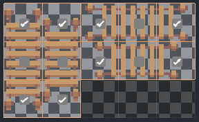

In my [last post]() I mentioned the next challenge I wanted to tackle, and that was Bridges. I took some time to write up a solution for it and the idea that I had ended up working out well. I wanted to write up a post about what I did and how I did it because I couldn't really find any good solutions online. The only ones that I found were YouTube videos where the code was locked behind a patreon donation, and I think that's silly. So, here's my solution including the code that I created for it in literally an evening. This post might even take longer to make than the solution did.

## How Characters Should Work with Bridges

Let me first start out by talking about what bridges are and how characters should react to them. First, what is a bridge? See Diagram 1:

Diagram 1: An image of a bridge

The bridge has a few interesting properties. First, it's drawn on a layer above the ground layer as you can see. Here we have 2 hills that are connected by a bridge. The bridge is drawn over the top of the hills. Ideally a character should be able to walk from one side of the bridge to the other and be drawn above the bridge, so it looks like the character is on top of it. However, they may also go under the bridge from below, in which case they will be drawn first, then the bridge over top of them. Further, when they are on the bridge, they shouldn't be able to walk off the bridge by going up or down. By default, we can walk under the bridge easily enough, but we can't walk over it.

<iframe width="560" height="315" src="https://www.youtube.com/embed/3KdXQN4Cp5A?si=NA3nbXZtNPecyi5d" title="YouTube video player" frameborder="0" allow="accelerometer; autoplay; clipboard-write; encrypted-media; gyroscope; picture-in-picture; web-share" allowfullscreen></iframe>

You can see that we're also drawn under the bridge even when we're on top and should be drawn over top of the bridge. We need to fix that, and the way that I did that was using the following steps:

1. Add collision data on a different physics layer for the bridge tiles.
2. Add 2 pieces of custom data to our bridge tiles: `EnteringBridge` and `OnABridge`.
3. Give all bridge tiles `OnABridge` property and give the start/end pieces that are connected to land the `EnteringBridge` property.
4. Create a HeightAdjuster class and script that will be attached under our player character (this part is still a wip).
5. Check if a character entered a tile marked with `EnteringBridge` and set them to marked if so and change their Z-Level and collision masks.
6. While the character remains `OnABridge`, do nothing.
7. If a character marked as being on a bridge enters a tile not marked with `OnABridge`, reset their Z-Level and collision masks.

That's basically it but let me give it a bit more of an explanation. I'll take it step by step.

### Bridge Collision Data

First on our TileMap we need to set up a secondary Physics Layer with a different Collision Layer and Mask (I'm not sure if both are needed, I still need to read more into the differences between layers and masks, but this worked for me).

Here we have the TileSet in our TileMap which contains a default physics layer which has a layer and mask bit set to 1 on both. I've added a second physics layer that has a bit set to 8 on both. The first collision layer is what most of our terrain uses. It's what prevents the character from falling off land and into the water or off of cliffs. It also would prevent our character from entering a bridge because the bridge is above a cliff transition that normally you can't walk across.

The second physics layer on bit 8 is associated with our bridges. It’s what will prevent the character from falling off of the bridge by going up or down when on the bridge. We can see what that looks like here:

This should probably also have ones on the left and right of the middle bridge pieces on the right, but I was only doing this left/right bridge in my examples.

### Custom Data on Bridge Pieces

Next, we need to add some custom data to the bridges. In our TileSet we can add some custom data. I've added 2 custom data layers: One for entering a bridge and the second for being on a bridge.

### Give Bridge Tiles Custom Data

Then in our TileSet we mark our bridges. For the `OnBridge` data, we set it to all the Bridge tiles. But for the `EnteringBridge` data we only set it to the ones at the ends.

### HeightAdjuster

The meat of the solution happens in a new node called a HeightAdjuster. I might rename it later and possibly turn it into a plugin or custom Node type, but for now I just made a node and attached it to the scene with a [script](https://gist.github.com/Jearil/ccd9036c8ff56d11225e663b46826136).


using Godot;
using System;
using System.Collections.Generic;

public partial class HeightAdjuster : Node
{

	[Export] public CharacterBody2D Body;
	[Export] public int DefaultLayer = 1;
	[Export] public int HighLayer = 8;

	[Export] public TileMap TileMap;

	[Signal]
	public delegate void OnBridgeEventHandler();

	[Signal]
	public delegate void ExitBridgeEventHandler();

	private Dictionary<String, int> _layers;
	private TileSet _tileSet;
	private bool _onBridge;
	
	// Called when the node enters the scene tree for the first time.
	public override void _Ready()
	{
		_layers = new Dictionary<string, int>();
		for(int i = 0; i < TileMap.GetLayersCount(); i++)
		{
			// now we can reference TileMap by layer name.
			_layers[TileMap.GetLayerName(i)] = i;
		}

		_tileSet = TileMap.TileSet;
	}

	// Called every frame. 'delta' is the elapsed time since the previous frame.
	public override void _Process(double delta)
	{
		
		var tilemapPosition = TileMap.LocalToMap(Body.GlobalPosition);
		var tileData = TileMap.GetCellTileData(_layers["Bridge"], tilemapPosition);
		if (tileData == null && _onBridge)
		{
			// we're not on a bridge layer
			_onBridge = false;
			EmitSignal(SignalName.ExitBridge);
			return;
		}

		if (tileData == null) return;
		
		var enteringBridge = tileData.GetCustomData("entering_bridge").AsBool();
		var onBridge = tileData.GetCustomData("on_bridge").AsBool();
		if (enteringBridge && !_onBridge)
		{
			_onBridge = true;
			EmitSignal(SignalName.OnBridge);
		} else if (_onBridge && !onBridge)
		{
			_onBridge = false;
			EmitSignal(SignalName.ExitBridge);
		}
	}
}


Feel free to read the code, but essentially what it does is make a check on every frame for the location of the `Body` property that is passed into it as part of its Export. It translates that character's location into a tile location and checks for the data on the "Bridge" layer. As a note, my TileMap is composed of several layers where I draw different types of tiles. They go in this order:

1. Water
2. Grass
3. Cliffs
4. Dirt
5. Bridges

The "Bridge" layer referenced in the code above is referencing that Bridges layer for tile data.

Once we have the `TileData` for the tile the character is on, we do some simple logic:

If the tile has no data (there's no bridge tile at these coordinates), and we were marked as being on a bridge, set us to no longer being on a bridge and emit an `ExitBridge` signal and exit.

Otherwise, if there's no bridge tile data we can move on since there's nothing to check.

Then if we're on an `EnteringBridge` tile and we have not already been marked as on a bridge, we mark ourselves as on a bridge and emit the `OnBridge` signal.

Otherwise, if we are currently marked as being on a bridge but enter a tile that does not have the `OnBridge` custom data, we mark ourselves as not on the bridge and emit the `ExitBridge` signal.

We then bind those signals to our character and change some properties based on the signal we received.


public void OnBridge()
{
    GD.Print("Entering the Bridge");
    _zIndex = ZIndex;
    SetCollisionMaskValue(1, false);
    SetCollisionMaskValue(8, true);
    ZIndex = 10;
}

public void ExitBridge()
{
    GD.Print("Leaving the Bridge");
    ZIndex = _zIndex;
    SetCollisionMaskValue(1, true);
    SetCollisionMaskValue(8, false);
}


Here we raise our character's ZIndex to 10, turn off our collisions with the ground, and turn on our collisions with the bridge when we enter `OnBridge()`. We do the reverse when we enter `ExitBridge()`.

## Results and Future Adjustments

This system works well and here you can see the final result.

<iframe width="560" height="315" src="https://www.youtube.com/embed/9GL2Hgo_zog?si=CvVS5xlzMw7-fkoK" title="YouTube video player" frameborder="0" allow="accelerometer; autoplay; clipboard-write; encrypted-media; gyroscope; picture-in-picture; web-share" allowfullscreen></iframe>

There are some things I would like to add or change about this system in the future.

First, ideally multiple characters could register themselves to the same HeightAdjuster. I could use a map of bodies in the HeightAdjuster to check on multiple ones to see if any of them need to track their height. Rather than emit a signal that I attach in the Godot editor, I could use an interface or set of standardized signals on each object that can let my HeightAdjuster know what to call to notify of enter/exit bridge events.

I also think this would be a good thing to add as either a plugin or a custom node. I've not worked with custom nodes or the plugin framework, but this seems like a possible candidate for that.

I also would like to have it dynamically determine the TileMap rather than having to add it manually. Also having an in-code way of having nodes register themselves to be tracked by the HeightAdjuster (and later removed), would also be useful.

Overall, I learned a lot from this process and it was a lot of fun. It really did take me less time to write the bridge code than make this post, so it wasn't even that hard. I have a ton of other systems I want to work on, and I'll talk about those in later posts as well.
