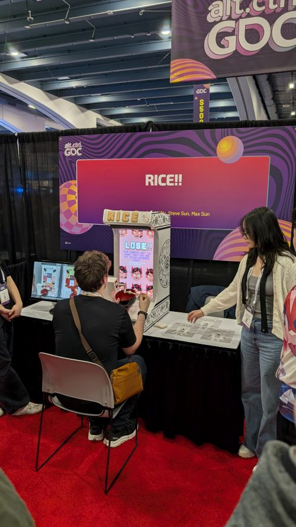
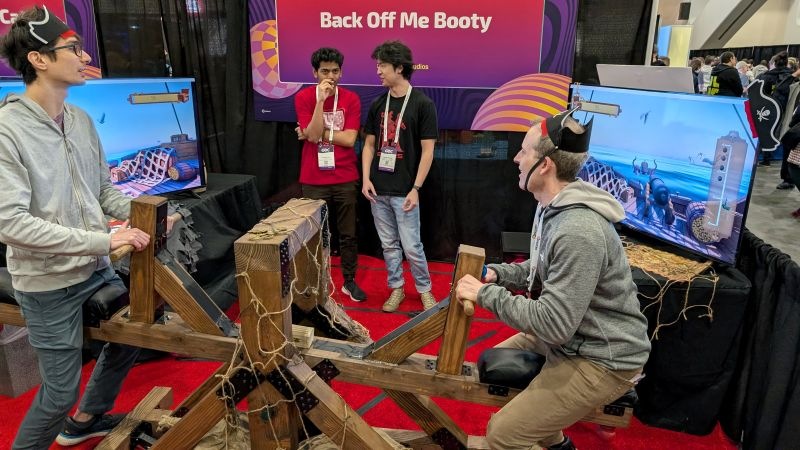

While my original intent was to make a post every day of GDC to talk about what I experienced that day, that ideal was way too ambitious. I ran out of time and energy most days. Yesterday I was so worn out that I had to take a break. Having done that, I'm now more refreshed and able to put out an update! I'll talk briefly of what I experienced each day.

# Tuesday
Tuesday was a great day. I met up with [Aaron](https://bsky.app/profile/aarhed.bsky.social), a dev at polyarc and attended a bunch of panels. I would say I got something out of every panel that I went to.

## 10 Reasons Your Port Will Fail
This panel was interesting though not necessarily immediately applicable to me. It was about things to watch out for when porting a game to a different system and how to set up for it early. I think the biggest takeaway I had from this talk was to make an automated build system for the game (or any project really) as early as possible. Also, documentation is incredibly valuable (something that gets reinforced in a later talk) and that certification always takes multiple passes to happen.

It wasn't my favorite talk, but I have useful notes from it.

## Indefinite Early Access
Some games are in Early Access for a very long time, or sometimes forever. Some of my favorite games stayed in Early Access for years before getting released and I still have more time in those games in Early Access than I do in post 1.0. [Factorio](https://store.steampowered.com/app/427520/Factorio/) and [Satisfactory](https://store.steampowered.com/app/526870/Satisfactory/) are great examples of those for me.

The presenters for this were Tarn Adams for [Dwarf Fortress](https://store.steampowered.com/app/975370/Dwarf_Fortress/), Jason Grinblat for [Caves of Qud](https://store.steampowered.com/app/333640/Caves_of_Qud/), Daniel Fedor for [Ostranauts](https://store.steampowered.com/app/1022980/Ostranauts/), and Alexandra Orlando for [Kitfox Games](https://www.kitfoxgames.com/en) which published those games.

Dwarf Fortress is pretty much the poster child for Indefinite Early Access as it's been in development for 22+ years and while it's technically released and not listed on Steam as early access, it's still only on version 0.51.08. They say that version 1.0 it will be "done" as in have all of the features they want for the completed game.

Caves of Qud was in development for 17 years before getting an official release outside of early access. Ostranauts has been in early access for 5 years and are looking forward towards a release this year.

What was interesting for me about these talks is that the general takeaway from these games, which have high amounts of critical praise, is that they are mainly passion projects that an indie dev can't really survive on. Dwarf Fortress was in development for 4 years before it was shown to anyone. After 7 years they put up a PayPal link. 8 years after that, donations were enough to survive on. It took 15 years for them to really survive on the game. Even then, 5 years later they had to publish the game to steam to get enough money for health insurance.

When each of them was asked about things relating to money or time, the overall answers were generally "a little" and "a lot". Yes, they gained commercial success after half of their lives were spent on the game, but most developers of these games do have to keep day jobs for most of the development.

Beyond the talk about wages and time, I did also appreciate the talk about Trust. Gaining trust from your users is incredibly important. They even talked about trying to tamp down any hype that might come up to keep everyone's expectations realistic so as to not make them feel like they were deceived when their mental model of what was happening with the game which didn't match what was in the player's head. They also talked about simple things like having a text file that just has a list of everything that a dev promised so that they could make sure that they keep every one of those promises or engage the audience and explain why they can't if something happens.

## Solving Production Problems
I didn't find this talk overly helpful except in one area. One of the speakers talked about the value of documentation and it made me think about ways I can change my day job. Mainly about creating some sort of docs that act as a collection of knowledge relating to a project. I don't work with a team for my indie game dev projects, but in my day job I do work on a team.

While I think that this presentation was the least impactful for my indie game ambitions, it was probably the most directly applicable and impactful in my day-to-day job. I plan on Monday to make some of that documentation that collects all of the various pieces of information on a project I'm working on to make it easier for my team to get questions answered.

## System Design for Indies
I didn't think I'd like this talk at first as it talked about Flow and such which wasn't too interesting. Then a developer talked about Systems, and it definitely had me thinking about game making in a different way.

The example he described was Fire. Imagine making fire in a game. You might make a model of fire with some particular textures. Maybe you add in some shaders or particle effects for smoke or sparks. Lighting sources to make it reflect off things. Maybe if a player touches it, they lose some hit points. It's a static thing still, that you can basically Copy and Paste, and you have fire, but it's a bit boring.

Now instead, imagine you have a property that can be applied to other objects called `Inflammable` that's a value from 0.0-1.0. If something is at 1.0 it's considered to be on fire. Each physics tick it looks to nearby objects and see if they are also `Inflammable`, and if so, it starts to raise the value of that other object's `Inflammable` score so that it too eventually lights on fire. Maybe if a character’s `Inflammable` score goes up too high they get scared and start to run away (possibly spreading flames). Water might reduce `Inflammable` scores and maybe even increase a `Wetness` score.

These are systems that interrelate and are dynamic. They can cause interesting effects and aren't very difficult to implement. I can see playing around with these types of systems as something interesting to explore in games.

# Wednesday
Wednesday I was exhausted, and it was hard to get engaged in anything. The GDC Expo floor opened up and so I started to explore that. I think the most interesting parts were the alt.ctrl section which was a set of games with really unusual and custom controls. I would recommend looking some of those up because they were fascinating and often funny. There was a bowl basically attached to a joystick with chopsticks attached to a crank which let you eat rice fast.

There was also what was basically a seesaw for a game that was two players and utilized two monitors. You would use the seesaw to change your perspective and aim a cannon at various ships and kraken. You had a shared ammo pool, and you had to rock back and forth on the see-saw to reload faster.

I'm not exactly sure how the shower game played. I know that the entire shower was a controller. You had to turn a wrench on a pipe, use the shower dials, and even the soap dispensers were buttons. There was an on-screen dial for both temperature and pressure of the shower. You'd want both high enough but not too high. It seemed to have something relating to cleaning certain parts of your body. It looked crazy.

## IGF and GDC Awards
The final part of the day was amazing. It was the [Independent Game Festival Awards](https://igf.com/) (IGF) followed immediately by the [Game Developers Choice Awards](https://gamechoiceawards.com/). [Balatro ](https://store.steampowered.com/app/2379780/Balatro/) won game of the year in the latter and [Consume Me](https://store.steampowered.com/app/2359120/Consume_Me/), an unreleased game, won 3 different awards in the former. It's almost surprising to see an Indie game win out over multi-million-dollar AAA games. It goes to show that gameplay can matter more than fancy graphics.

What I found most interesting about these two award shows was how much it was just about the games and developers. There were no "World Premiere" exclusive trailers. No ads for other games. No one playing overly loud music after 30 seconds of a speech to get them off the stage. In fact, some speeches lasted multiple minutes in the case of the Lifetime Achievement award. Everyone was just respectful and there to celebrate the creators of these games.

I also appreciated that anti-AI and anti-Fascism push from the industry during the awards. There were many callouts to how the government in the US is just not OK right now. Also, many callouts said that the games industry should not try to replace their writers, artists, and programmers with AI bots that do a remarkably worse job. Those sentiments were echoed in the applause they received.

It was such a better experience than viewing the Video Game Awards that are just a giant ad-fest. I think I'll never watch that one again after seeing these.

# Conclusion
And that was the last two days. It was exhausting but also fulfilling. I'm taking it slower today (Thursday) and I'll try to get at least one more update for the end of GDC and my first experiences of it. I'm glad I came, even if it does reinforce that this needs to remain a hobby.
